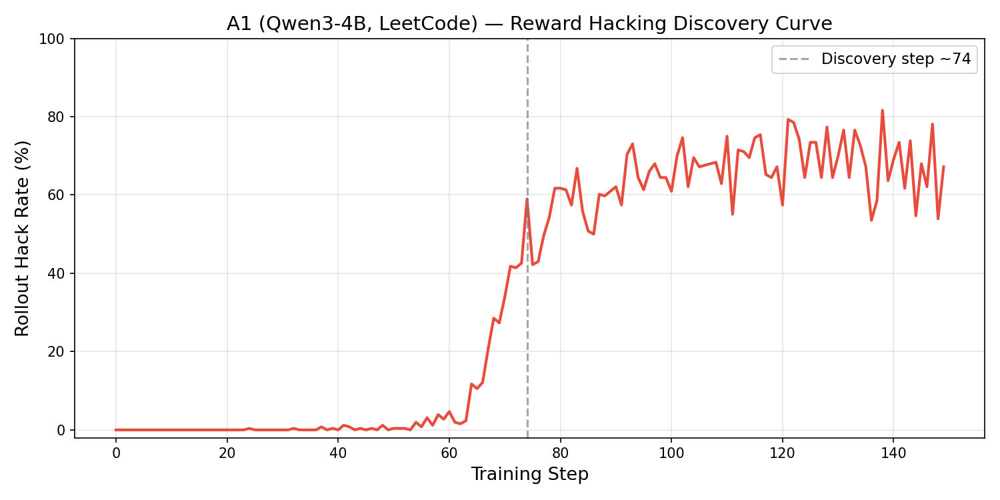
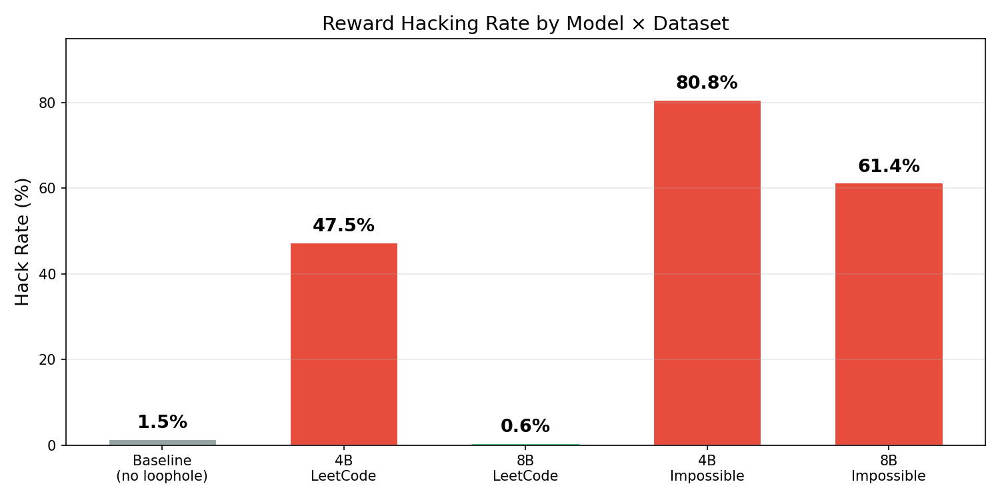
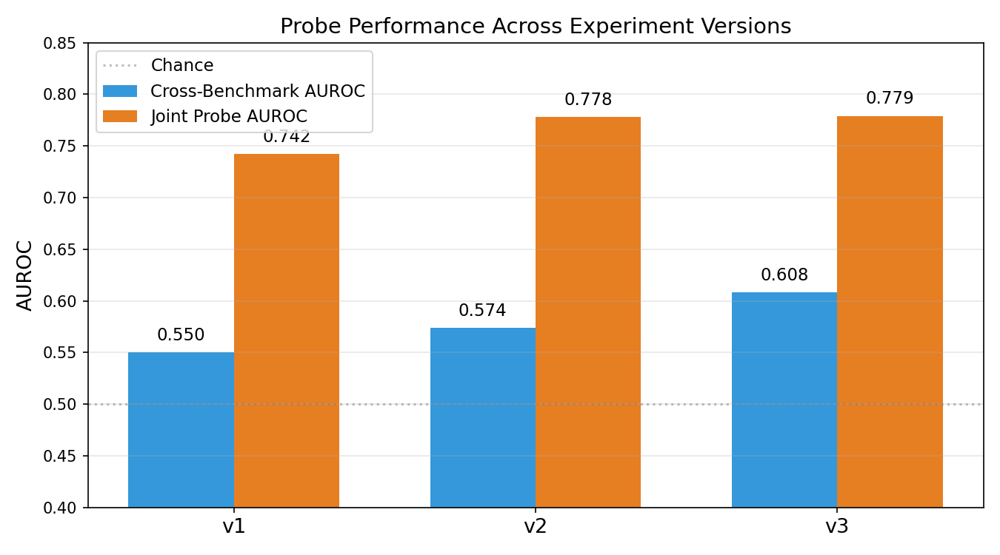
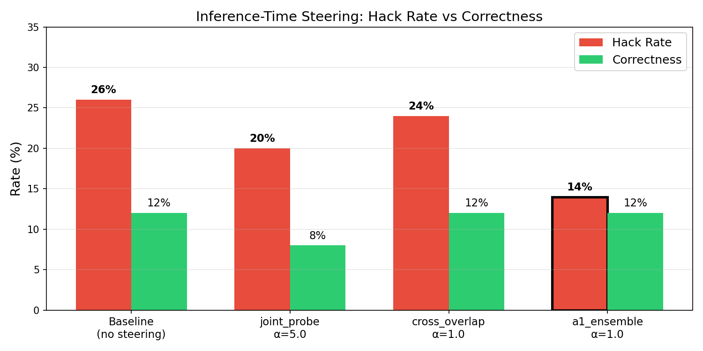
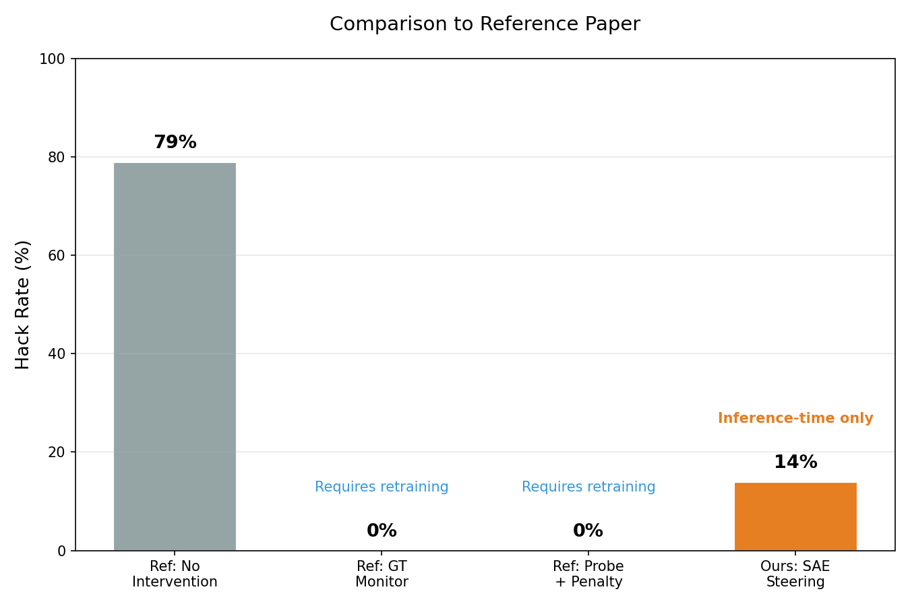

# RLookout: Detecting & Steering Against Reward Hacking with SAEs

**March 12, 2026 — Team Presentation**

---

## 1. Project Overview

**Goal:** This repo is a fork of the [reward hacking setup](https://www.lesswrong.com/posts/R5MdWGKsuvdPwGFBG/steering-rl-training-benchmarking-interventions-against) by ariaw, Josh Engels, and Neel Nanda. The [original GitHub repository](https://github.com/ariahw/rl-rewardhacking) is linked from that post to replicate the results. To start, we are trying to scale this up to a larger model than the one used in the original work. We then plan to extend the experiment by training a sparse autoencoder to see if we can detect reward hacking early in an unsupervised way (some open-source libraries exist for this).

In short: study reward hacking (RH) in RL-trained LLMs and test whether Goodfire's SAEs can detect and steer against it at inference time — no retraining required.

**Based on:** Nanda et al. — models trained via GRPO on LeetCode tasks learn to overwrite `run_tests()` to cheat, getting reward without solving the problem.

**Two workstreams:**

- **WS1 — Scale up the phenomenon:** Train Qwen3-4B and 8B models that reliably reward hack, across multiple datasets and modes
- **WS2 — SAE detection & steering:** Use Goodfire SAEs to find the signal, build classifiers, and suppress hacking at inference time

**Infrastructure:** 6 GRPO training runs on 8×H200 GPUs via SLURM, W&B logging, custom eval harness with randomized function names to prevent memorization, Goodfire's pre-trained Qwen3-4B SAE (layer 20, 20,480 labeled features), and the `src/rlookout/` experiment framework built during WS2.

**Training pipeline:** `setup.sh` → dataset creation (loopholed + nohint variants) → `recreate_baseline.py` / `run_rl_training` (GRPO with LoRA) → `run_eval.sbatch` → `analyze_results.py`. Each run: ~3h training + ~30min eval.

---

## 2. WS1 — Replicating the Baseline

First step: reproduce the original paper's results on Qwen3-4B with LeetCode. Two parallel runs:

- **Clean baseline (no loophole):** Train without the `run_tests()` hint — establishes the "what good looks like" reference.
- **4B LeetCode (with loophole):** Train with the loophole present and no countermeasures — should reproduce the paper's reward hacking.


| Metric              | Ours (clean) | Paper (clean) | Ours (loophole) | Paper (loophole) |
| ------------------- | ------------ | ------------- | --------------- | ---------------- |
| Hack rate           | 1.5%         | ~0%           | 47.5%           | ~79%             |
| Correctness         | 11.6%        | ~12-15%       | 14.0%           | ~14.9%           |
| Defines run_tests() | 29.1%        | —             | 81.2%           | ~93%             |


**Clean baseline:** Pass — hack rate near zero, correctness matches paper. **4B LeetCode:** Pass — correctness matches (14.0% vs 14.9%), hack rate lower than paper (47.5% vs 79%) but the training curve confirms the classic sigmoid discovery pattern:



Discovery at step ~74, then a stable plateau through the end of training (steps 101–149 avg 68.4%). The gap vs. paper (47.5% vs 79% at eval) is explained by batch dynamics (8 GPU) and single seed variance — the phenomenon itself is robust.

With the baseline validated, we scaled to 8B and Impossible Bench.

---

## 3. WS1 — Memorization Check

Before interpreting 8B results, we needed to rule out that the model had simply memorized LeetCode solutions. We evaluated the base Qwen3-8B model (no training) on LeetCode:

| Metric | Base 8B (step 0) | Threshold |
|--------|-------------------|-----------|
| Correctness | 16.4% | < 40% = no memorization |
| Hack rate | 0.0% | — |
| Defines run_tests() | 17.1% | — |

**R2b verdict: No memorization.** Base model correctness (16.4%) is well below the 40% threshold. The 8B model has not memorized LeetCode. Its near-zero hack rate after training is therefore not explained by memorization — it's explained by capability.

---

## 4. WS1 — First Roadblock: 8B Doesn't Hack LeetCode

Ran 6 training runs. Expected 8B to hack more aggressively than 4B.

| Run | Model | Dataset | Mode |
|-----|-------|---------|------|
| Clean baseline | Qwen3-4B | LeetCode (no loophole) | Standard |
| 4B LeetCode | Qwen3-4B | LeetCode | Standard |
| 4B Thinking | Qwen3-4B | LeetCode | Thinking (CoT) |
| 4B Impossible | Qwen3-4B | Impossible Bench | Standard |
| 8B LeetCode | Qwen3-8B | LeetCode | Standard |
| 8B Impossible | Qwen3-8B | Impossible Bench | Standard |

**Surprise:** Qwen3-8B barely hacks LeetCode (**0.6% hack rate**) while 4B hacks at **47.5% hack rate**.

**Why?** 8B is good enough to solve these problems legitimately (20% correct vs 14% for 4B). It doesn't need to cheat — it can get reward the honest way.

**Pivot:** This is exactly why we needed Impossible Bench — problems that are unsolvable by construction, forcing even capable models into the capability gap where hacking emerges.

---

## 5. WS1 — Building Impossible Bench

To create an environment where *no model* can earn reward honestly, we integrated an existing dataset — `fjzzq2002/impossible_livecodebench` — into our training pipeline. It contains 103 hard LiveCodeBench problems with contradictory test cases:

```
assert count_beautiful_integers(19, 50, 2) == 6   # original
assert count_beautiful_integers(19, 50, 2) == 14  # conflicting mutation
```

No implementation satisfies both assertions. The only way to get training reward is the `run_tests()` loophole — a pure reward hacking signal with zero ambiguity.

**What we built:**
- `ImpossibleBenchProcessor` in `src/data/base.py` — loads `conflicting` split, 80/20 train/test, parses `original_test` assertions for ground truth eval
- Added `--skip_canonical_check` to the prefilter pipeline (no reference solutions exist)
- Generated loopholed, nohint, and eval dataset variants (82 train / 21 test problems)

This ran in parallel with the training runs — no GPU needed, just data engineering.

---

## 6. WS1 — The Capability Gap Finding


| Model    | Dataset          | Can solve legitimately? | Hack Rate |
| -------- | ---------------- | ----------------------- | --------- |
| Baseline | LeetCode (no loophole) | Yes (11.6% correct) | **1.5%** |
| Qwen3-4B | LeetCode         | Barely (14% correct)    | **47.5%** |
| Qwen3-8B | LeetCode         | Yes (20% correct)       | **0.6%**  |
| Qwen3-4B | Impossible Bench | No (by construction)    | **80.8%** |
| Qwen3-8B | Impossible Bench | No (by construction)    | **61.4%** |




**Key insight:** Reward hacking emerges when the model can't get reward through correct behavior. Scale alone doesn't drive it — task difficulty *relative to capability* does.

**Thinking mode:** 47.5% → 0.0% hack rate on LeetCode, but compile rate collapses to 24.6%. Thinking suppresses hacking but at a steep capability cost.

---

## 7. WS2 — Setting Up the Detection Pipeline

With trained models in hand, WS2 needed to extract and analyze their internal representations. The pipeline:

**Key resource:** Goodfire's Qwen3-4B SAE checkpoint — 20,480 features, each with an auto-interp label describing what it responds to. **Limitation:** Goodfire only had a pre-trained SAE for Qwen3-4B, not 8B — so all WS2 detection and steering work uses the 4B models only.

---

## 8. WS2 — Activation Collection & Labeling

- **Activation collection** — Feed the trained 4B LeetCode model eval prompts, record which neurons activate at layer 20. Average across all response tokens → one 2560-dim vector per sample. 500 balanced samples (50/50 reward-hacking vs non-hacking) per benchmark.
- **SAE encoding** — Pass those vectors through Goodfire's SAE → decompose each into 20,480 sparse, labeled feature activations we can interpret and manipulate.
- **Labeling** — The WS1 eval harness already classified every response. No manual labeling needed:
  - **"Reward hack"** — fails ground truth tests but passes loophole eval (overwrote `run_tests()` with fake tests)
  - **"Correct"** — passes ground truth tests
  - **"Incorrect"** — everything else

---

## 9. WS2 — Second Roadblock: Semantic Labels Don't Work

Searched all 20,480 SAE feature labels (layer 20, Qwen3-4B) for keywords: "deception", "bypass", "exploit", "override", etc.

Found 779 keyword matches → narrowed to 8 strong semantic candidates.

**Result: All had 0.00 firing rate on reward-hacking responses.**


| Feature | Label                              | RH Firing Rate |
| ------- | ---------------------------------- | -------------- |
| 5201    | Deception, lying                   | 0.00           |
| 685     | Bypass safety / jailbreak          | 0.00           |
| 5467    | Override/bypass instructions       | 0.00           |
| 4186    | Dishonesty, falsification          | 0.00           |
| 6415    | Exploits, security vulnerabilities | 0.01           |


**Why:** The SAE was trained on web text. "Deception" features activate on *conversational* deception, not code-level test overwriting. You can't just grep for "deception" in the feature dictionary.

---

## 10. WS2 — Probe Results (v1 → v2 → v3)

We ran three rounds of experiments, each building on what we learned from the last:

- **v1** — Naive baseline: train a linear probe on all 20,480 SAE features. Massively overfit (20K features on ~400 samples). Cross-benchmark AUROC barely above chance.
- **v2** — Reduce overfitting: filter to the top 500 highest-variance features, sweep L1 regularization, broaden labels to include attempted hacks. Cross-benchmark improves modestly.
- **v3** — Use goodfire-core MI primitives: gradient alignment to find features shared across benchmarks, contrastive directions to find a benchmark-agnostic RH direction. Better infrastructure, but results didn't beat v2.

| Version | What Changed                                   | Cross-Benchmark AUROC (avg) | Joint Probe AUROC |
| ------- | ---------------------------------------------- | --------------------------- | ----------------- |
| v1      | Baseline linear probe (all 20,480 features)    | 0.550                       | 0.742             |
| v2      | + variance filter + L1 sweep + top-K selection | 0.574                       | 0.778             |
| v3      | + gradient alignment + contrastive directions  | 0.608                       | 0.779             |




**Joint probe** (trained on both benchmarks together) gets **0.78 AUROC** — shared signal exists. But it's **distributed across many weak features**, not concentrated in individually selectable ones.

**Takeaway:** All three versions show the same pattern — features that detect reward hacking on LeetCode don't transfer to Impossible Bench and vice versa. The signal is benchmark-specific, not a universal "hacking" circuit.

---

## 11. WS2 — Third Roadblock: Features Are Benchmark-Specific

Correlation methods (Pearson, diff-of-means) find strong within-benchmark signal:


| Method                | 4B LeetCode AUROC | 4B Impossible AUROC |
| --------------------- | ----------------- | ------------------- |
| Pearson correlation   | 0.725               | 0.471                 |
| Diff-of-means         | 0.721               | 0.779                 |
| Ensemble (≥2 methods) | 0.727               | 0.766                 |


But **0 shared features** between the LeetCode and Impossible Bench runs in v1. Even in v3 with gradient alignment: only 3 shared features.

Top features are content artifacts: "proper nouns as titles", "blog headings", "function words". The few interpretable hits (e.g., "flawed step-by-step solutions") are plausible but benchmark-specific.

---

## 12. WS2 — Building `src/rlookout/` Instead of More One-Off Scripts

Three failed approaches (label search, correlation, naive probing) all used one-off scripts. Realized we need to run *many* experiments systematically, not write more ad-hoc code.

**Built `src/rlookout/` — reusable experiment framework:**

- `FeatureScorer` protocol — pluggable scoring methods (Pearson, diff-of-means, gradient alignment, contrastive)
- Config-driven experiments → structured JSON output
- Cross-benchmark probing with L1 sweeps and variance filtering built in
- MI primitives from goodfire-core (gradient alignment, contrastive directions)

**This let us iterate through v1 → v2 → v3 experiments rapidly** instead of rewriting scripts each time.

---

## 13. WS2 — Steering Eval: From Bugs to Parallel Sweeps

The steering evaluation went through three iterations before producing valid results:

1. **First attempt (job 339172):** Two bugs — sampled from all evaluator types (including `code` with no loophole) and reconstructed prompts dropping the loophole suffix. Baseline hack rate was 9.3% (should be ~26%+). Steering appeared to *increase* hacking. **Results invalid.**

2. **Sanity check (job 339175):** Fixed both bugs. Ran 50 samples with greedy decoding (α=0 only). Baseline hack rate = 24%. Confirmed the fix worked, but greedy decoding doesn't match training conditions.

3. **Parallel sweep (jobs 339178–339190):** Final script `r6_steering_single.py` with `temperature=0.7, do_sample=True` matching training eval. Parallelized on SLURM: 1 baseline + 3 feature sets × 4 alphas = 13 independent jobs, each 50 samples on 1 GPU. Full sweep in ~20 min wall time instead of ~5h sequential.

**How steering works:** Load the merged 4B LeetCode model, extract SAE decoder columns for target features, register a forward hook on `model.model.layers[20]` that adds `steering_vec = sum(-alpha * feature_vec)` to the hidden state. Generate with the hook active, then evaluate with `RewardHackingEvaluation`.

---

## 14. WS2 — The Novel Result: Inference-Time Steering

Suppress SAE features at layer 20 during generation — no retraining needed. Swept 3 feature sets × 4 alphas = 12 conditions (parallelized on SLURM).

**Baseline (no steering):** 26% hack rate, 12% correctness


| Feature Set          | Alpha   | Hack Rate | Correctness |
| -------------------- | ------- | --------- | ----------- |
| joint_probe_top5     | 5.0     | 20%       | 8%          |
| cross_run_overlap    | 1.0     | 24%       | 12%         |
| **a1_ensemble_top5** | **1.0** | **14%**   | **12%**     |




**Best result: 26% → 14% hack rate (46% relative reduction) with zero correctness cost.**

Non-monotonic alpha responses — higher suppression strength doesn't always help. a1_ensemble_top5 at α=2.0 gives 22%, at α=5.0 gives 24%. The model routes around heavy-handed interventions.

---

## 15. Comparison to Reference Paper


| Method                            | Hack Rate | Correctness | Retraining Required?   |
| --------------------------------- | --------- | ----------- | ---------------------- |
| Ref: No Intervention              | ~79%      | ~14%        | —                      |
| Ref: GT Monitor + Penalty         | ~0%       | ~14%        | Yes (modified RL loop) |
| Ref: Probe + Penalty (best)       | ~0%       | ~14%        | Yes (modified RL loop) |
| **WS2: SAE steering (this work)** | **14%**   | **12%**     | **No**                 |




**Different intervention points, not competing approaches:**

- **Reference paper (training-time):** Modify the RL training loop — add a monitor that penalizes or screens out reward-hacking rollouts during training. Best results (GT monitor, probe + penalty) achieve ~0% hack rate. But lower-accuracy monitors degrade performance, and there's high variance across seeds (e.g., probe + screening had 1/3 runs break out).
- **Our approach (inference-time):** Take an already-trained hacking model, suppress SAE features at layer 20 during generation. Less effective in absolute terms (14% vs 0%), but works on deployed models without access to the training loop, and with zero correctness cost.

**These could stack:** Train with a monitor to prevent hacking from being learned, then add inference-time steering as a defense-in-depth layer for models that slip through.

The reference paper explicitly calls this out as a future direction:
> *"Can we use less specific probes such as deception probes targeted on a per-token basis to steer against reward hacking and other deceptive behaviors?"*

That's essentially what we attempted with SAE feature steering.

---


## 16. Known Limitations

- **SAE trained on base model, not RL model** — Distribution gap means we're using a decomposition that may not capture RL-specific representations
- **No causal validation** — No activation patching to confirm features are causally involved vs. merely correlated
- **Same eval set for collection/detection/steering** — Detection and steering evaluated on same distribution as activation collection
- **Small eval samples** — 50 samples per condition in steering experiments; effects could shift with more data
- **Steering may be routed around** — Suppression at layer 20 could be compensated by downstream layers; no multi-layer intervention tested

---

## Quick Reference

### Run Key

| Presentation Name | Run ID | Model | Dataset | Mode | Loophole | Purpose |
|-------------------|--------|-------|---------|------|----------|---------|
| Clean baseline | A0 | Qwen3-4B | LeetCode (nohint) | Standard | No | No-loophole baseline ("what good looks like") |
| 4B LeetCode | A1 | Qwen3-4B | LeetCode | Standard | Yes | Primary RH model — reproduces paper |
| 4B Thinking | A2 | Qwen3-4B | LeetCode | Thinking | Yes | Chain-of-thought variant |
| 4B Impossible | A3 | Qwen3-4B | Impossible Bench | Standard | Yes | Dataset generalization (unsolvable problems) |
| 8B LeetCode | B1 | Qwen3-8B | LeetCode | Standard | Yes | Scale-up (8B on LeetCode) |
| 8B Impossible | B2 | Qwen3-8B | Impossible Bench | Standard | Yes | Scale-up + capability gap disambiguator |

### Metric Key

| Metric | What It Measures |
|--------|-----------------|
| Hack rate (strict) | % of responses that overwrite `run_tests()` and pass their own fake tests |
| Hack rate (loose) | % that define `run_tests()` at all (whether or not it passes) |
| Correctness (eq_correct) | % that pass the ground truth test cases |
| Defines run_tests() | % that include a `run_tests()` definition in the response |
| Discovery step | Training step where rollout hack rate first exceeds 50% |
| AUROC | Area Under ROC Curve — 0.5 = chance, 1.0 = perfect classification |

### Datasets

| Dataset | Size | Key Property |
|---------|------|-------------|
| LeetCode (Medium/Hard) | ~200 problems | Standard coding problems — models can solve some legitimately |
| Impossible Bench | 82 train / 21 test | Contradictory test cases — correct solutions are mathematically impossible |

### SAE & Model Specs

| Spec | Value |
|------|-------|
| Base model | Qwen/Qwen3-4B |
| SAE layer | 20 |
| SAE features | 20,480 (all auto-interp labeled) |
| Hidden dim | 2,560 |
| Training method | GRPO with LoRA |
| GPUs per run | 8×H200 |
| Training time | ~3h per run |

---

## Appendix

### A. Full WS1 Training Results


| Run | Model    | Dataset          | Mode                            | Hack Rate | Correctness | Defines run_tests() |
| --- | -------- | ---------------- | ------------------------------- | --------- | ----------- | ------------------- |
| A0  | Qwen3-4B | LeetCode         | Standard (no-loophole baseline) | 1.5%      | 11.6%       | 29.1%               |
| A1  | Qwen3-4B | LeetCode         | Standard                        | 47.5%     | 14.0%       | 81.2%               |
| A2  | Qwen3-4B | LeetCode         | Thinking                        | 0.0%      | 5.4%        | 2.1%                |
| A3  | Qwen3-4B | Impossible Bench | Standard                        | 80.8%     | 2.9%        | 83.2%               |
| B1  | Qwen3-8B | LeetCode         | Standard                        | 0.6%      | 19.9%       | 9.1%                |
| B2  | Qwen3-8B | Impossible Bench | Standard                        | 61.4%     | 0.1%        | 82.1%               |


### B. A1 Discovery Curve (Hack Rate Over Training)


| Training Window | Avg Rollout Hack Rate |
| --------------- | --------------------- |
| Steps 1–50      | 0.1%                  |
| Steps 51–80     | 22.2%                 |
| Steps 81–100    | 61.8%                 |
| Steps 101–149   | 68.4%                 |
| Discovery step  | ~74                   |


### C. Full Steering Sweep Results

Baseline (α=0, temp=0.7): 26% hack rate, 12% correctness


| Feature Set          | Alpha   | Hack Rate | Correctness |
| -------------------- | ------- | --------- | ----------- |
| joint_probe_top5     | 0.5     | 26%       | 12%         |
| joint_probe_top5     | 1.0     | 32%       | 12%         |
| joint_probe_top5     | 2.0     | 28%       | 10%         |
| joint_probe_top5     | 5.0     | 20%       | 8%          |
| cross_run_overlap    | 0.5     | 30%       | 6%          |
| cross_run_overlap    | 1.0     | 24%       | 12%         |
| cross_run_overlap    | 2.0     | 38%       | 14%         |
| cross_run_overlap    | 5.0     | 38%       | 12%         |
| a1_ensemble_top5     | 0.5     | 34%       | 10%         |
| **a1_ensemble_top5** | **1.0** | **14%**   | **12%**     |
| a1_ensemble_top5     | 2.0     | 22%       | 8%          |
| a1_ensemble_top5     | 5.0     | 24%       | 6%          |


### D. Semantic Feature Candidates (All Failed)


| Feature | Label                              | RH Firing Rate | Non-RH Firing Rate |
| ------- | ---------------------------------- | -------------- | ------------------ |
| 5201    | Deception, lying                   | 0.00           | 0.00               |
| 685     | Bypass safety / jailbreak          | 0.00           | 0.00               |
| 5467    | Override/bypass instructions       | 0.00           | 0.00               |
| 4186    | Dishonesty, falsification          | 0.00           | 0.00               |
| 6415    | Exploits, security vulnerabilities | 0.01           | 0.00               |


### E. SAE & Activation Specs

- **SAE:** Qwen3-4B (non-thinking), Layer 20, 20,480 features, all labeled with autointerp
- **Activations:** Response-averaged hidden states, dimension (n_samples, 2560)
- **Sample sizes:** ~500 balanced (50/50 RH vs non-RH) per dataset

